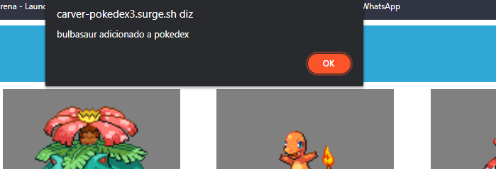

# Projeto Pokedex
# Projeto realizado pelos alunos Edson Batista Magnini Junior, Alisson Abílio e Renan Moreira Rodrigues
# Projeto contempla menu contendo 20 pokemons, adicionar pokemon a pokedex e remover pokemon da pokedex 

# Main

# Adicionar pokemon a pokedex

# Pokedex

# Remover pokemon da pokedex

# Link do surge: carver-pokedex3.surge.sh
